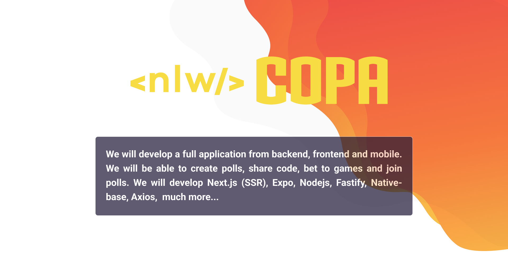
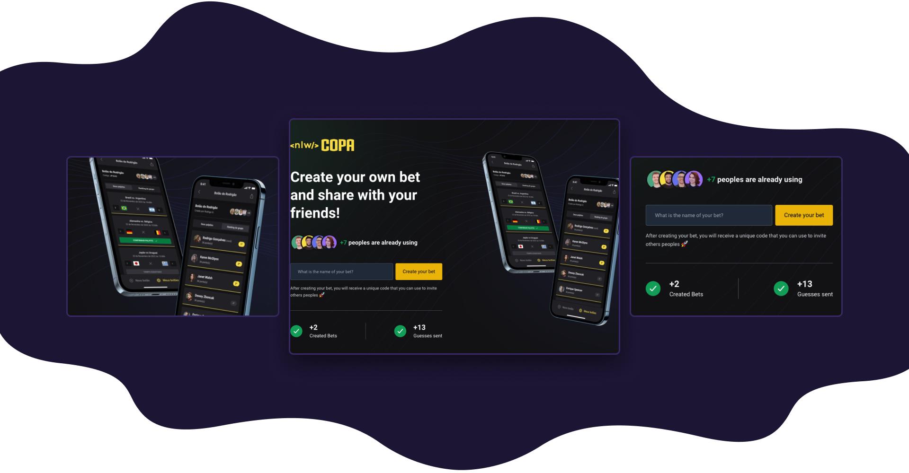

<br/><br/>

<h2 align="center">🧭 Roadmap</h2>
<hr/>
<br/>

### 🖥 Step 01

<br/>

<p>Starting with Node.js order of components and folder structure</p>

<br/>

### 🖥 Step 02

<br/>

<p>Developing webpage with Next.js, making connection with backend.</p>

<br/>

### 🖥 Step 03

<br/>

<p>Developing mobile app with Expo, making connection with backend.</p>

<br/>

### 🖥 Step 04

<br/>

<p>Mobile App, connect with Google Auth API, e finishing last components and fix´s.</p>

<br/><br/>

<h2 align="center">🛠 Installation</h2>
<hr/>
<br/>

You can use [git](https://git-scm.com) or a tool like [degit](https://github.com/Rich-Harris/degit) to clone my projects for your directory.

```sh
#clone project repository
git clone HTTTPS-or-SSH-URL
#OR
npx degit gw-rodrigues/repository-name new-project-folder-name

#go to project folder
cd new-project-folder-name

#install dependencies
npm install
#OR
yarn

#start project developer mode
npm run dev
#OR
yarn dev
```

<br/><br/>

<h2 align="center">🔬 More</h2>
<hr/>
<br/>

[](./LICENSE)


